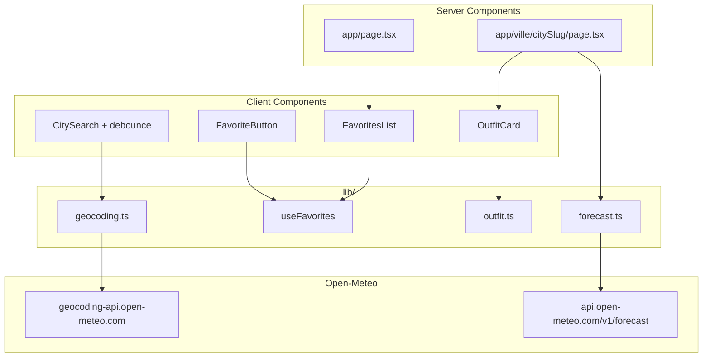

# PLAN.md — MeeThéo

Document de suivi global pour le mini-projet Next.js.

**Règle :** ne lancer une phase que lorsqu'elle est validée explicitement. Un commit par phase.

---

## Contexte et objectifs

| Élément           | Décision                                                                                                          |
| ----------------- | ----------------------------------------------------------------------------------------------------------------- |
| Nom               | **MeeThéo**                                                                                                       |
| Stack             | Next.js 16.2, React 19, TypeScript, Tailwind CSS 4, App Router                                                    |
| APIs              | [Open-Meteo Geocoding](https://open-meteo.com/en/docs/geocoding-api) + [Forecast](https://open-meteo.com/en/docs) |
| Design            | [DESIGN.md](DESIGN.md) — thème DevLog (dark, terminal-inspired)                                                   |
| UI                | Français (chaînes dans `lib/constants.ts`, pas de lib i18n)                                                       |
| Route ville       | `/ville/[geocodingId]-[slug]` (ex. `/ville/2988507-paris`)                                                        |
| Carte             | Lien externe OpenStreetMap (sans dépendance Leaflet)                                                              |
| Feature originale | **Prévision d'outfit** selon météo du jour                                                                        |

---

## État actuel du dépôt (18 juil. 2026)

| Élément | Statut |
| ------- | ------ |
| Working tree | **Propre** — aucun fichier non commité |
| Dernier commit | `8c06437` — Phase 0 (Phase 1 en attente de commit) |
| Design system DevLog | ✅ Appliqué (Phase 1) |
| Commit initial | `1864234` — `first commit` (README anticipé, à réécrire en Phase 9) |
| `PLAN.md` | ✅ À jour |
| `DESIGN.md` | ✅ Présent, **non appliqué** au CSS |
| Bootstrap Next.js | ✅ `app/`, configs, `package.json` (`meetheo`) |
| Arborescence vide | ✅ `components/.gitkeep`, `lib/.gitkeep`, `public/screenshots/.gitkeep` |
| Metadata | ✅ Titre **MeeThéo**, `lang="fr"` |
| Intégration API | ⬜ Aucune |
| Fonctionnalités métier | ⬜ Aucune |

### Fichiers présents aujourd'hui

```
app/
  favicon.ico, globals.css, layout.tsx, page.tsx   ← page placeholder MeeThéo
components/.gitkeep
lib/.gitkeep
public/screenshots/.gitkeep
PLAN.md, DESIGN.md, .env.example, .gitignore
```

### Ce qui n'existe pas encore (à créer phase par phase)

- Composants UI, layout, recherche, météo, favoris, outfit
- Couche API (`lib/api/`, types, utils)
- Routes dynamiques `app/ville/[citySlug]/`
- Route Handlers `app/api/`
- États `loading.tsx`, `error.tsx`, `not-found.tsx`

---

## Architecture cible



### Séparation Server / Client

| Zone | Type | Raison |
| ---- | ---- | ------ |
| Layout, pages ville | Server Component | Fetch météo côté serveur, SEO |
| `CitySearch`, favoris | Client Component | `useState`, `localStorage`, debounce |
| `loading.tsx`, `error.tsx`, `not-found.tsx` | Conventions App Router | Feedback utilisateur |
| Fetch météo détail | Server + `revalidate: 1800` | Cache 30 min |
| Géocodage recherche | Route Handler `/api/geocode` | Centraliser + typer |

### Structure de dossiers cible

```
app/
  layout.tsx, page.tsx, globals.css
  loading.tsx, error.tsx, not-found.tsx
  api/geocode/route.ts, api/weather/route.ts
  ville/[citySlug]/
    page.tsx, loading.tsx, error.tsx, not-found.tsx
components/
  ui/          Button, Card, Input, Chip, Label, Skeleton
  layout/      Header, Footer, Container, Providers
  search/      CitySearch
  weather/     CurrentWeatherCard, ForecastList, WeatherIcon, SunTimes
  favorites/   FavoritesList, FavoriteButton
  outfit/      OutfitCard
lib/
  api/geocoding.ts, forecast.ts
  types/geocoding.ts, weather.ts, favorites.ts
  utils/city-slug.ts, weather-codes.ts, outfit.ts, format.ts, cn.ts
  hooks/useFavorites.tsx
  constants.ts
public/screenshots/   ← captures à ajouter par toi
```

---

## APIs Open-Meteo

### Géocodage

```
GET https://geocoding-api.open-meteo.com/v1/search
  ?name={query}&count=5&language=fr
```

- Min **3 caractères**, debounce **300 ms**

### Prévisions

```
GET https://api.open-meteo.com/v1/forecast
  ?latitude={lat}&longitude={lon}&timezone=auto&forecast_days=7
  &current=temperature_2m,relative_humidity_2m,apparent_temperature,
           weather_code,wind_speed_10m,wind_direction_10m,
           surface_pressure,uv_index,is_day
  &daily=weather_code,temperature_2m_max,temperature_2m_min,
         sunrise,sunset,uv_index_max,precipitation_probability_max
```

### Carte OSM

```
https://www.openstreetmap.org/?mlat={lat}&mlon={lon}#map=12/{lat}/{lon}
```

---

## Feature originale — Prévision d'outfit

Moteur de règles pur (`lib/utils/outfit.ts`) :

| Condition | Suggestions |
| --------- | ----------- |
| Ressenti < 5°C | Manteau chaud, écharpe, gants |
| 5–15°C | Veste, pull |
| 15–22°C | Tenue légère, veste fine optionnelle |
| > 22°C | T-shirt, short/robe légère |
| Pluie (> 50% prob. ou codes WMO 51–67, 80–82) | Parapluie, veste imperméable |
| Vent > 30 km/h | Coupe-vent |
| UV ≥ 6 | Lunettes, crème solaire, chapeau |
| Neige (codes 71–77, 85–86) | Bottes, manteau imperméable |

Affichage : carte sur page détail + résumé compact sur favoris (accueil).

---

## Phases et commits

### Phase 0 — Fondations projet ✅ TERMINÉE

**Commit :** `8c06437` — `feat: :sparkles: project fundations`

- [x] Metadata **MeeThéo** + description FR
- [x] `.gitignore` enrichi (`.cursor/`, `Thumbs.db`, `*.local`, `/.pnpm-store`, `!.env.example`)
- [x] `.env.example`
- [x] Arborescence `components/`, `lib/`, `public/screenshots/`
- [x] `package.json` → `meetheo`
- [x] `PLAN.md` + `DESIGN.md`
- [x] Bootstrap Next.js (Tailwind 4, TypeScript, ESLint)

---

### Phase 1 — Design system DevLog ✅ TERMINÉE

**Commit suggéré :** `feat(design): apply DevLog tokens and fonts`

- [x] Remplacer Geist par **Inter** + **JetBrains Mono** (`next/font/google`)
- [x] Porter tokens [DESIGN.md](DESIGN.md) → `app/globals.css` (couleurs, radius 4px, glows)
- [x] Configurer Tailwind `@theme` avec tokens DevLog
- [x] Composants UI : `Button`, `Card`, `Input`, `Chip`, `Label`
- [x] Layout : `Header` (logo MeeThéo), `Footer` (attribution Open-Meteo CC BY 4.0), `Container`
- [x] Intégrer Header/Footer dans `app/layout.tsx`

**Fichiers créés :** `components/ui/*`, `components/layout/*`, `lib/utils/cn.ts`

---

### Phase 2 — Types TypeScript et couche API ✅ TERMINÉE

**Commit suggéré :** `feat(api): add Open-Meteo types and fetch helpers`

- [x] Types : `GeocodingResult`, `WeatherResponse`, `FavoriteCity`, etc.
- [x] `lib/api/geocoding.ts` — `searchCities()`, `getCityById()`
- [x] `lib/api/forecast.ts` — `getWeather()` avec `cache()` + `revalidate: 1800`
- [x] `lib/utils/city-slug.ts` — `toCitySlug()`, `parseCitySlug()`, `cityPath()`, `osmMapUrl()`
- [x] `lib/utils/weather-codes.ts` — labels FR + icônes WMO
- [x] `lib/utils/format.ts` — température, vent, dates FR
- [x] `lib/constants.ts` — chaînes UI, clés storage, constantes API
- [x] `app/api/geocode/route.ts`
- [x] Zéro `any`

---

### Phase 3 — Recherche de villes ✅ TERMINÉE

**Commit suggéré :** `feat(search): add city search with autocomplete`

- [x] `CitySearch` (client) : debounce 300 ms, min 3 chars
- [x] Liste suggestions (nom, région, pays)
- [x] Navigation `Link` → `/ville/{id}-{slug}`
- [x] États chargement / vide / erreur
- [x] Accessibilité : `aria-expanded`, clavier, focus ring vert

---

### Phase 4 — Gestion des favoris ✅ TERMINÉE

**Commit suggéré :** `feat(favorites): add localStorage favorites with UI`

- [x] `lib/hooks/useFavorites.tsx` — Context + `localStorage` (`meetheo:favorites`)
- [x] Type `FavoriteCity` : `{ id, name, latitude, longitude, country, admin1 }`
- [x] `FavoriteButton` (étoile pleine/vide)
- [x] `FavoritesProvider` dans layout
- [x] Indicateur cohérent sur toutes les pages (recherche + liste favoris)
- [x] `FavoritesList` basique (cartes météo en Phase 5)

---

### Phase 5 — Page d'accueil complète ✅ TERMINÉE

**Commit suggéré :** `feat(home): build homepage with search and favorites`

- [x] Hero « MeeThéo » + `CitySearch`
- [x] Section favoris avec `FavoritesList`
- [x] Cartes météo légères (temp via `/api/weather`)
- [x] État « aucun favori »
- [x] Responsive mobile / tablette / desktop (grille 1/2/3 colonnes)
- [x] Toute navigation via `<Link>`

---

### Phase 6 — Page détail ville ✅ TERMINÉE

**Commit suggéré :** `feat(city): add dynamic city detail page`

- [x] `app/ville/[citySlug]/page.tsx` — Server Component async
- [x] Parser slug → `getCityById()` → `getWeather()`
- [x] Conditions actuelles : temp, ressenti, humidité, pression, vent, UV, ciel
- [x] Prévisions 7 jours : min/max + icônes
- [x] Lever / coucher du soleil
- [x] Lien « Voir sur la carte » (OSM)
- [x] Bouton favori + lien retour accueil
- [x] `notFound()` si ville invalide

---

### Phase 7 — Fonctionnalité outfit ✅ TERMINÉE

**Commit suggéré :** `feat(outfit): add daily outfit suggestion based on weather`

- [x] `lib/utils/outfit.ts` — moteur de règles
- [x] `OutfitCard` sur page détail
- [x] Résumé outfit sur cartes favoris (accueil)
- [x] Chips DevLog (veste, parapluie, etc.)

---

### Phase 8 — États Next.js ✅ TERMINÉE

**Commit suggéré :** `feat(ui): add loading, error and not-found states`

- [x] `app/loading.tsx` — skeleton DevLog
- [x] `app/error.tsx` — bouton « Réessayer »
- [x] `app/not-found.tsx` — 404 personnalisée
- [x] `app/ville/[citySlug]/loading.tsx`
- [x] `app/ville/[citySlug]/error.tsx`
- [x] `app/ville/[citySlug]/not-found.tsx`

---

### Phase 9 — README et documentation ✅ TERMINÉE

**Commit suggéré :** `docs: write complete README for submission`

- [x] Réécrire [README.md](README.md) aligné sur le code actuel
- [x] Nom + description, fonctionnalités, outfit, technologies
- [x] Installation `pnpm install` → `pnpm dev`
- [x] Variables d'environnement
- [x] Choix Server vs Client Components
- [x] Section captures `public/screenshots/`
- [x] Attribution Open-Meteo CC BY 4.0

---

### Phase 10 — Qualité finale ⬜ PROCHAINE

**Commit suggéré :** `chore: final polish and lint pass`

- [ ] `pnpm lint` sans erreur
- [ ] `pnpm build` réussi
- [ ] Responsive vérifié (3 breakpoints)
- [ ] Pas de code mort ni `console.log`
- [ ] Historique Git lisible
- [ ] Dépôt public prêt pour soumission

---

## Checklist livrables (sujet PDF)

| Livrable | Phase | Statut |
| -------- | ----- | ------ |
| PLAN.md | 0 | ✅ |
| .gitignore configuré | 0 | ✅ |
| Bootstrap Next.js + metadata MeeThéo | 0 | ✅ |
| Code source complet | 0–10 | ✅ |
| README.md détaillé (à jour) | 9 | ✅ |
| Captures d'écran | 9–10 | ⬜ |
| Recherche + géocodage | 3 | ✅ |
| Météo actuelle + prévisions 7j | 6 | ✅ |
| Favoris localStorage | 4 | ✅ |
| Feature originale outfit | 7 | ✅ |
| Routes dynamiques | 6 | ✅ |
| Server + Client Components | 2–7 | ✅ |
| loading / error / not-found | 8 | ✅ |
| TypeScript strict (pas de any) | 2 | ✅ |
| Cache API | 2 | ✅ |
| UI responsive + DESIGN.md | 1, 5–7 | 🔄 (accueil ✅) |
| Historique Git propre | toutes | 🔄 (10/11 phases) |

### Captures à réaliser (par toi, Phase 9–10)

1. Accueil — recherche + favoris
2. Résultats de recherche / suggestions
3. Page détail ville complète
4. Gestion favoris (ajout / suppression)
5. Outfit suggestion en action

---

## Historique Git

```
main
 ├── 1864234  first commit              (README anticipé)
├── 8c06437  feat: project fundations  ← Phase 0 ✅
 ├── …        feat(design): …           ← Phase 1 (à committer)
 ├── …        feat(api): …               ← Phase 2 (prochaine)
 └── …
```

**Convention :** `feat(scope):`, `fix(scope):`, `chore:`, `docs:`

---

## Prochaine étape

**Phase 10 — Qualité finale** (lint, build, polish)

Dis « go phase 10 » pour lancer la validation finale.

---

## Références

- [React](https://fr.react.dev/)
- [Next.js App Router](https://nextjs.org/docs/app)
- [Open-Meteo Forecast API](https://open-meteo.com/en/docs)
- [Open-Meteo Geocoding API](https://open-meteo.com/en/docs/geocoding-api)
- [DESIGN.md](DESIGN.md)
